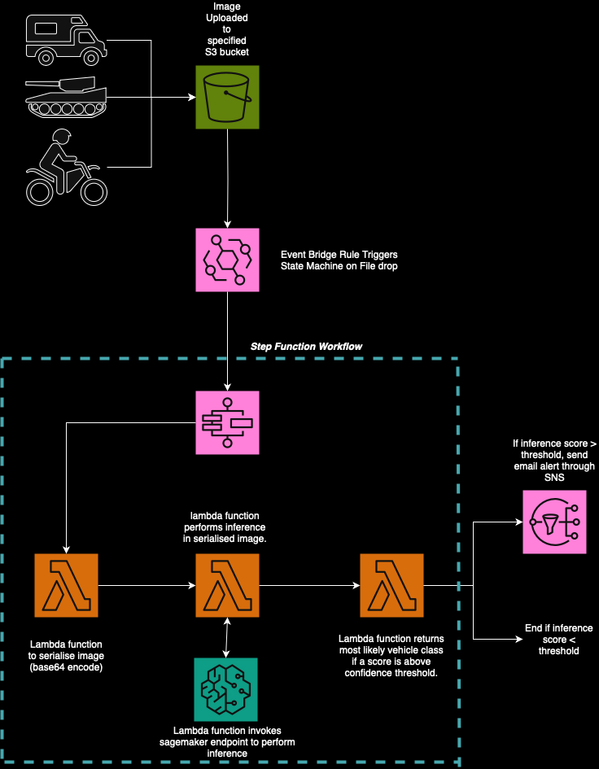
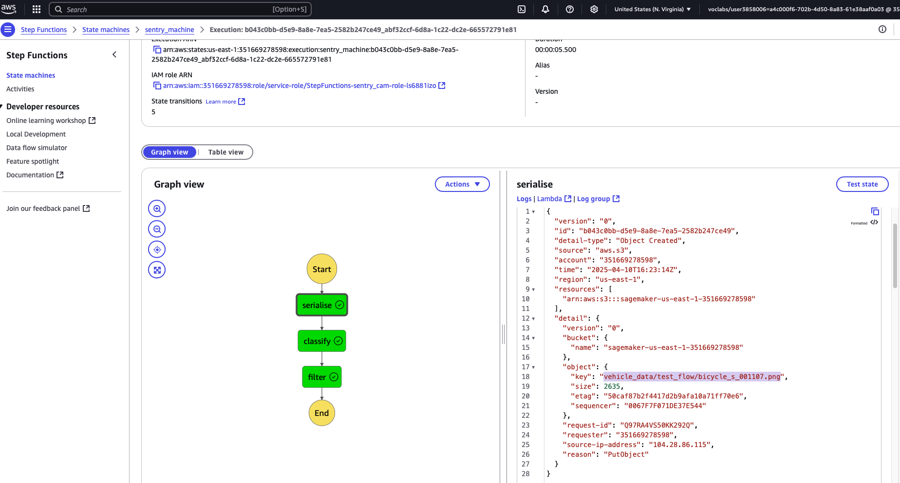
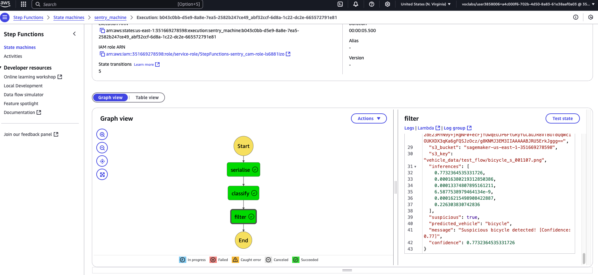
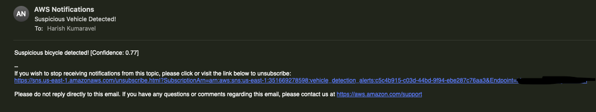

# 🚨 SentryCam-AWS

**A real-time, low-latency vehicle detection pipeline for ATM surveillance, built using AWS Sagemaker, Lambda, Step Functions, S3, EventBridge, and SNS.**

---

## 📌 Overview

This project simulates an intelligent surveillance system for ATM locations. It uses real-time image classification to detect specific vehicle types and flag suspicious activity. If a high-risk vehicle is detected (e.g., motorcycle, pickup truck), the system raises an automated email alert.

Using the CIFAR-100 dataset as a proxy, this project demonstrates the use of **AWS serverless architecture** to deliver an **end-to-end ML inference pipeline** triggered by an image upload.

> 💡 Can be explanded to different use cases, for example for smart city monitoring!

---

## 🎯 Objectives

- 🎯 Detect suspicious vehicles from uploaded images in near real time  
- ⚙️ Automate model inference using AWS Step Functions and Lambda
- 🔐 Trigger alerts via email using SNS for effective alerting 
- 🗂 Leverage S3 and EventBridge to orchestrate the pipeline  


---

## 🧱 Architecture


**Pipeline Flow:**

1. 📤 Image uploaded to S3 and Eventbridge rule invokes state machine
**Step Function**
2. ⚙️ Lambda 1 (serialize): Base64-encodes the image and passes it forward
3. 🧠 Lambda 2 (classify): Invokes a deployed SageMaker endpoint and returns inference values
4. ✅ Lambda 3 (filter): Applies confidence threshold, classifies vehicle type, and triggers notification if suspicious
5. 📩 If flagged: SNS sends an email alert




---

## 🖼️ Dataset

The **CIFAR-100** dataset was filtered to include the following vehicle classes, potentially suspicious vehicles:

| Class Label    | ID  | 
|----------------|-----|
| `bicycle`      | 0   | 
| `motorcycle`   | 1   | 
| `pickup_truck` | 2   | 
| `bus`          | 3   | 
| `tank`         | 4   | 
| `tractor`      | 5   | 

- These were the different vehicles that were identified from the dataset as being potentially suspicious vehicles. The `EDA_notebook` then filters the dataset accordingly and saves the data for training

---

## 🛠 Setup

### Prerequisites

- AWS account with access to:
    - Sagemaker
    - Lambda
    - Step Function
    - Event Bridge
    - SNS
- Python 3.8 or above

### Installation

`git clone https://github.com/Harish8622/SentryCam-AWS`
`cd SentryCam-AWS`

### 🚀 Project Walkthrough

#### 🧠 Model Training

1. **Explore and Filter the CIFAR-100 Dataset**  
   In the `EDA_notebook.ipynb`, the CIFAR-100 dataset is filtered to retain specific vehicle classes including `bicycle`, `motorcycle`, `pickup_truck`, `tractor`, `bus`, and `tank`. Each class is mapped to a label, and both training and test images are exported to local directories.

   `s3://your-bucket-name/vehicle_data/train/`

   
   `s3://your-bucket-name/vehicle_data/test/`

3. **Model Training with SageMaker**  
In the `Model_training_notebook.ipynb`, a SageMaker `Estimator` is configured with:
- The image classification built-in algorithm (`image_uris`)
- S3 input paths for training and validation
- `.lst` files for data-label mapping
- Data config for inference logs

After training completes, the model is deployed to a real-time endpoint for inference.  
**⚠️ Make note of the SageMaker endpoint name**, as it will be used in the Lambda function for inference.

---

#### ⚙️ Step Function Workflow

4. **Create Three Lambda Functions** (located in `Lambda_functions/`):
- `lambda_serialize`: Downloads the image from S3, base64-encodes it so it can be passed in json format between lambdas, and returns it along with metadata.
- `lambda_classify`: Sends the image to the SageMaker endpoint and returns inference results for each vehicle class.
- `lambda_filter`: Decodes inference output, checks if confidence exceeds a defined threshold, and returns an alert if a suspicious vehicle is detected.

**Required IAM Permissions:**
- All Lambda functions: `AmazonS3FullAccess` (or scoped S3 access)
- `lambda_classify`: `AmazonSageMakerFullAccess` to invoke the endpoint

5. **Create the Step Function**  
The state machine should:
- Trigger each Lambda in sequence
- Use `ResultSelector` to extract only relevant keys from each output
- Pass a clean, flattened payload between steps

✅ Example payload to test the state machine:

```json
{
  "image_data": "",
  "s3_bucket": "your-bucket-name",
  "s3_key": "vehicle_data/test/bike_s_002009.png",
  "inferences": ""
}
```

#### 🌉 EventBridge Trigger

6.	Automatically Trigger the Pipeline on File Upload
Create an EventBridge rule to watch the relevant S3 prefix:

 ```json
{
  "source": ["aws.s3"],
  "detail-type": ["Object Created"],
  "detail": {
    "bucket": {
      "name": ["bucket"]
    },
    "object": {
      "key": [{
        "prefix": "path_to_image_folder"
      }]
    }
  }
} 
```

- Set the target to your Step Function ARN
- Ensure your S3 bucket grants EventBridge access in its permissions

#### 📬 SNS Alerts
7.	Set Up Email Notifications
- Create an SNS topic
- Subscribe your email to the topic
- Modify `lambda_filter` for the SNS topic ARN

### Now the Pipeline is ready

- When an image is uploaded to the configured S3 bucket, you will recieve an email notification if there is a suspicious vehicle detected!
- **ensure you delete your endpoint and shut down any instances when you are finished**.

## 📸 Project Demonstration

The following screenshots walk through the end-to-end execution of the SentryCam pipeline.

---

### 1. 🖼️ Upload Image to S3

An image is uploaded to the `vehicle_data/test_flow/` folder in the S3 bucket, which triggers the pipeline automatically via EventBridge rule.

image uploaded:


---

### 2. ⚙️ Step Function Triggered with Input Payload

The image upload invokes the Step Function, and the Lambda serialise function extracts and encodes the image data.



---

### 3. ✅ Step Function Execution Output

After passing through the first two lambda function, the final one results in the output, the inference scores for each vehicle class, and after filtering, outputs if a suspicious vehicle is detected


---

### 4. 📬 Email Notification Triggered by SNS

When a suspicious vehicle is detected with confidence above the threshold, an SNS email is sent to the registered recipient. This was invoked in the third lambda function.



---

This confirms the successful automation of image-based vehicle detection and notification using AWS services.


## ✨ “Future Work

- Create a dashboard to visualise alerts over time and to allow users to upload their own images.
- Replace the base model what a custom trained and hyperparameter-tuned CNN.
- Add additional vehicle classes.
- Use higher definition images to improve accuracy.
- Allow users to provide feedback on alerts to fine tune model.


**Author: Harish Kumaravel**
